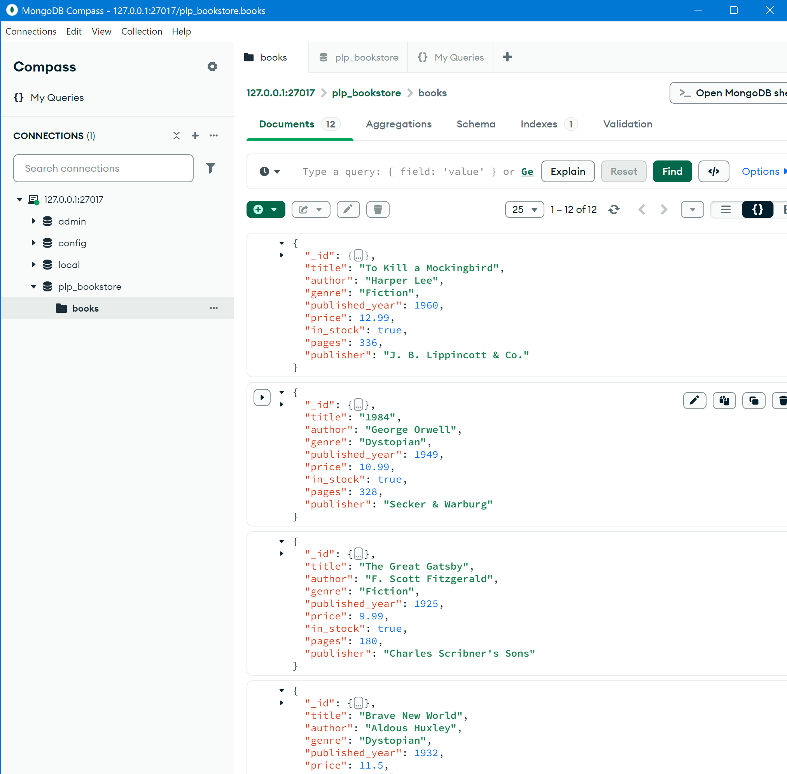

# MongoDB Week 1 Assignment – PLP Bookstore

## Files
- `insert_books.js` — Script to insert sample books  
- `queries.js` — MongoDB queries (CRUD, filtering, aggregation, indexing)  
- `screenshot.png` — My screenshot showing sample data in MongoDB Compass/Atlas  
- `README.md` — This file

## Prerequisites
- Node.js and MongoDB installed (local or Atlas)  
- VSCode recommended

## Setup & Run
1. Clone repo and open in VSCode  
2. Install MongoDB driver: `npm install mongodb`  
3. Insert data: `node insert_books.js` (connects to localhost MongoDB)  
4. Run queries via Mongo Shell (`mongosh`) or MongoDB Compass using `queries.js`

## My Screenshot

The image below shows the `plp_bookstore` database, `books` collection, and sample documents inserted by `insert_books.js`:

